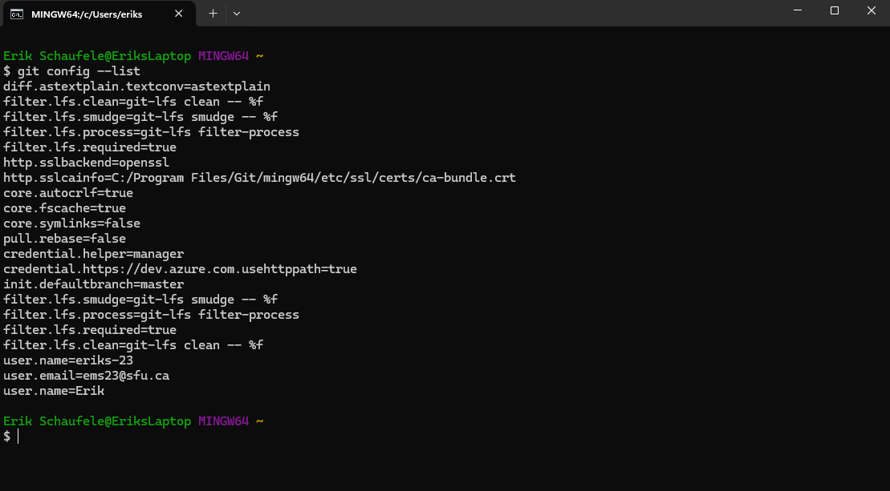
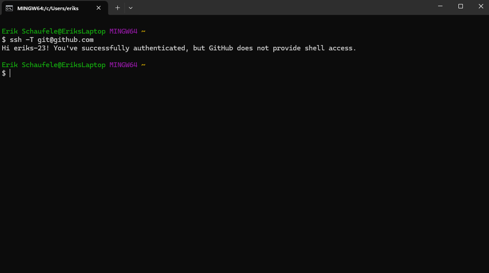
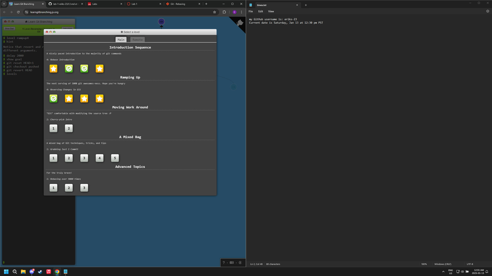
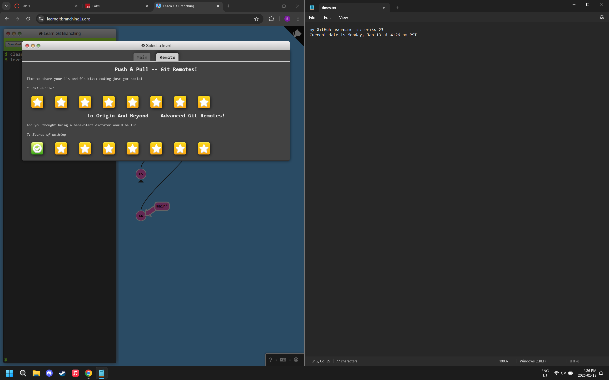

# 276-Lab1

## System Preparations

GitHub username: eriks-23

Git bash screenshots taken: Saturday, Jan 11 at 11:20 pm PST

## Github Tutorial

## Lab Questions

1. What is the difference between Git and GitHub?
Git is a distributed version control system (DVCS) GitHub is the cloud-based storage service for managing git repositories.

(Info from class video: https://stream.sfu.ca/Media/Play/eda12fecb8dc4f77909c6130a5f0359a1d)

2. What is a distributed version control system?
A distributed version control system is a model where instead of a centralized repository the full copy project is on each member's local repository. This allows changes to be made faster with merging and branching along with removing the risks of a central database if it fails.

(Info from: https://about.gitlab.com/topics/version-control/benefits-distributed-version-control-system/)

3. Explain the three states of git in your words.
The three states of git are modified, staged and committed. Modified is when a file is changed but has not been committed to the repository. Staged is when a file is marked as modified so that it's current version is to go into the next commit. Committed is when the data is safely stored in the local database. An analogy for this is a letter: modified is similar to writing the letter, staged is similar to putting it in an envelope and committing is similar to mailing it.

(Info and analogy from class video: https://stream.sfu.ca/Media/Play/eda12fecb8dc4f77909c6130a5f0359a1d)

4. In your own words, describe the following git commands:
    i. git clone: clones/copies a git repository
    ii. git status: shows the state of the working directory and the staging area
    iii. git fetch: "fetch" the content from a remote repository
    iv. git init: initializes a new repository
    v. git log: shows committed snapshots

(Info from interactive tutorial: https://learngitbranching.js.org/)

5. What is a .gitignore file and its purpose?
A .gitignore file tells Git the files that should be ignored when committing to the repository this can help prevent unwanted files from being committed this could be particularly helpful in a large project for instance working on a large project in C with a lot of .o files that you may not want or need in the repository.

## Video Questions

1. Summarize the video into 4-5 sentences
The SDLC is composed of 7 phases these include: planning, requirement analysis, design, implementation, testing, deployment, and maintenance. To make an application first a customer and project manager figure out what the application requires a diverse team further analyzes these requirements and creates a plan. Next during the design phase, the team figures out how to make the product work and what it will be like they then move onto building it and testing it, ensuring it works as intended. Once all testing and bugs are fixed the application is deployed to users. After release the application is maintained by the team by fixing further bugs, expanding servers etc. to make sure it continues to run smoothly this in turn can leas to the cycle beginning again.

2. In your own words, explain why the Software Development Life Cycle (SDLC) is important in software projects.
The SDLC is important in software projects because it ensures that tasks and challenges are conquered in a sensical order. For instance building an application without a plan for a final product would waste time and resources. The SDLC also allows all parties to work with one another and provide feedback especially in the requirement analysis phase. The SDLC is also important for continuous upkeep of the final product.

(Info from video provided: https://www.youtube.com/watch?v=i-QyW8D3ei0)